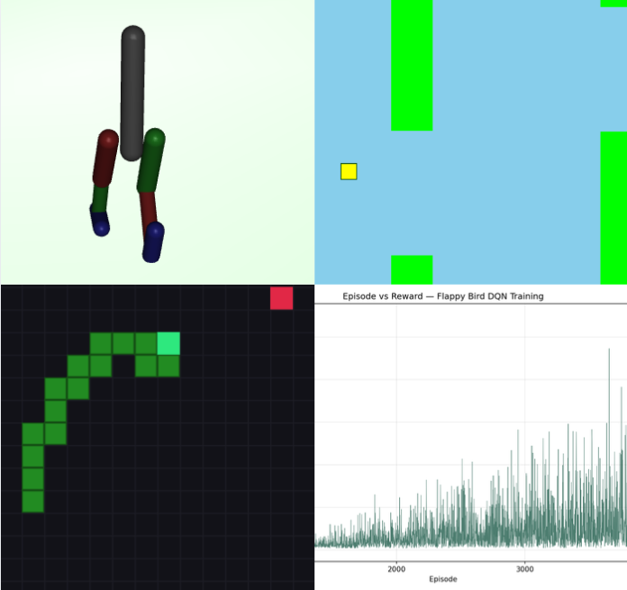

# RL Arcade

> A collection of reinforcement-learning agents learning to complete tasks across custom game environments and a continuous-control robotics simulation.

## What is this?

This project is a collection of reinforcement-learning agents, each placed in a unique environment and trained to perform a different task:

- Flappy Bird environment with custom physics, collision detection, observations, and rewards
- Snake environment with relative movement actions, collision awareness, and directional state features
- Dueling Deep Q-Network architecture that separately estimates state value and action advantages
- Double DQN target calculation to reduce overestimation of action values
- Prioritized experience replay with importance-sampling weights
- Epsilon-greedy exploration with environment-specific decay schedules
- Frozen target network synchronized periodically during training
- Multithreaded telemetry that records training episodes without blocking the learner
- Pygame renderers for replaying recorded Flappy Bird and Snake episodes
- Live comparison between trained DQN policies and random-action baselines
- Custom MuJoCo biped environment with six continuous motor controls
- Proximal Policy Optimization with generalized advantage estimation
- Online observation normalization using Welford's algorithm
- Reward shaping for forward movement, balance, control effort, and smooth movement
- Atomic model checkpoints and a MuJoCo viewer for watching the trained biped policy

The Flappy Bird and Snake agents use Dueling Double DQN with prioritized replay, while the MuJoCo biped uses PPO for continuous control. The included Windows demo lets viewers compare trained game agents against random baselines, watch recorded episodes during live DQN training, and launch the trained biped in MuJoCo.

## Why did I make this?

I wanted to understand reinforcement learning beyond applying an existing library to a prebuilt environment. Building the environments, agents, replay buffer, telemetry system, and renderers myself forced me to understand how each part of the training pipeline affects an agent's behavior.

Flappy Bird and Snake provided a way to explore value-based learning in environments with very different observations and reward structures. The MuJoCo biped extended the project into continuous control, where the agent must coordinate multiple joints while balancing, moving forward, and avoiding unstable actions. Through this project, I learned how to design observations and rewards, implement DQN and PPO training loops, debug unstable policies, manage model checkpoints, and visualize learning without interrupting training.

## How to use/install

The precompiled demo supports 64-bit Windows 10 and Windows 11. Reviewers do not need Python, Docker, a virtual environment, or an internet connection.

1. Download the release ZIP `RLArcade-Windows.zip` and extract it to a normal folder.
2. Confirm that `RLArcade.exe` and `BipedDemo.exe` are in the same folder.
3. Double-click `RLArcade.exe`.
4. If Windows SmartScreen appears, select **More info**, then **Run anyway**. The executable is unsigned, so Windows may display this warning.
5. Wait for the application to open. The first launch may take several seconds because the bundled Python and PyTorch files are unpacked temporarily.
6. Select **Flappy Bird** or **Snake** from the Environment menu.
7. Select **Comparison** mode to watch the trained DQN and random baseline run side by side.
8. Select **Live training** mode and click **Start training** to train a new DQN from scratch while recorded episodes play in the application. Click **Stop** to end after the current episode.
9. Click **Watch MuJoCo** to open the trained biped in the native MuJoCo viewer. Keep `BipedDemo.exe` beside `RLArcade.exe` so this button can find it.
10. Close the MuJoCo viewer and RL Arcade normally when finished.

New live-training checkpoints are stored under `%LOCALAPPDATA%\RLArcade`. They do not overwrite the trained models bundled with the demo.

To run the executables directly from this repository, open the `dist` folder and launch `RLArcade.exe`. `BipedDemo.exe` can also be opened directly to launch the trained biped viewer.
